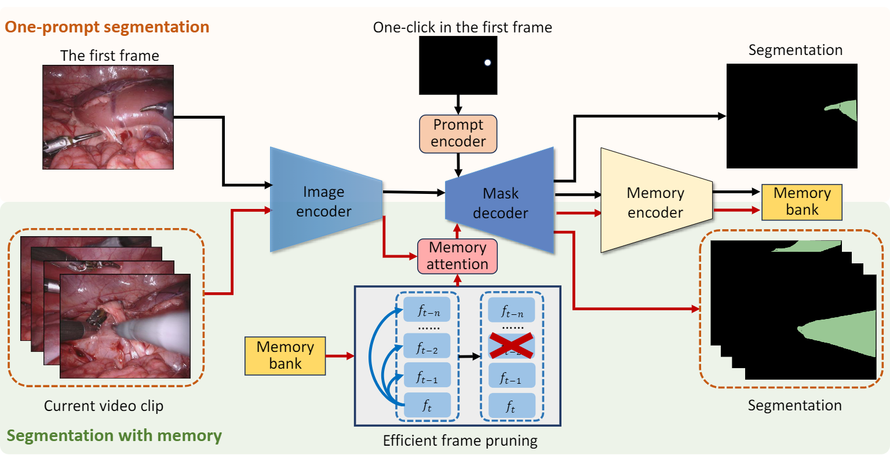

# Surgical SAM 2: Real-time Segment Anything in Surgical Video by Efficient Frame Pruning

Official implementation for SurgSAM2, an innovative model that leverages the power of the Segment Anything Model 2 (SAM2), integrating it with an efficient frame pruning mechanism for real-time surgical video segmentation. Paper in [arxiv](https://arxiv.org/abs/2408.07931).

We introduce Surgical SAM 2 (SurgSAM-2), an innovative model that leverages the power of the Segment Anything Model 2 (#SAM2), integrating it with an efficient frame pruning mechanism for real-time surgical video segmentation. The proposed SurgSAM-2

- dramatically reduces memory usage and computational cost of SAM2 for real-time clinical application;
- achieves superior performance with 3× FPS (86 FPS), making real-time surgical segmentation in resource-constrained environments a feasible reality.



## Training

The source code is coming soon

## Citation

```
@misc{liu2024surgicalsam2realtime,
 title={Surgical SAM 2: Real-time Segment Anything in Surgical Video by Efficient Frame Pruning}, 
author={Haofeng Liu and Erli Zhang and Junde Wu and Mingxuan Hong and Yueming Jin},
 year={2024},
 eprint={2408.07931},
 archivePrefix={arXiv},
 primaryClass={cs.CV},
 url={https://arxiv.org/abs/2408.07931}, 
}
```